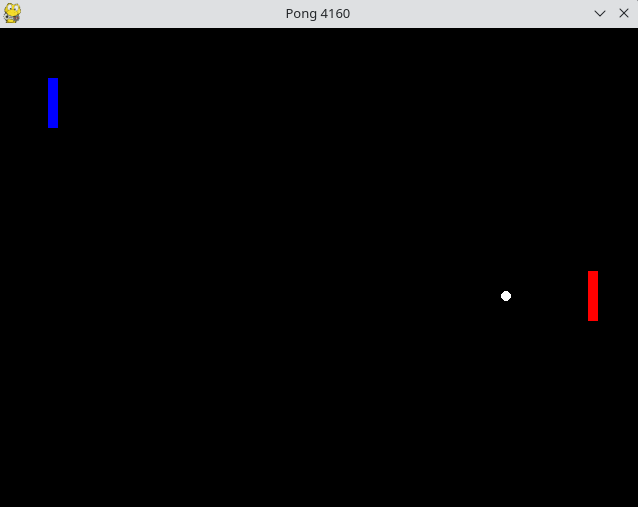
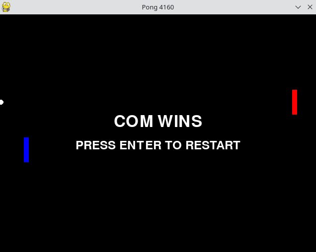
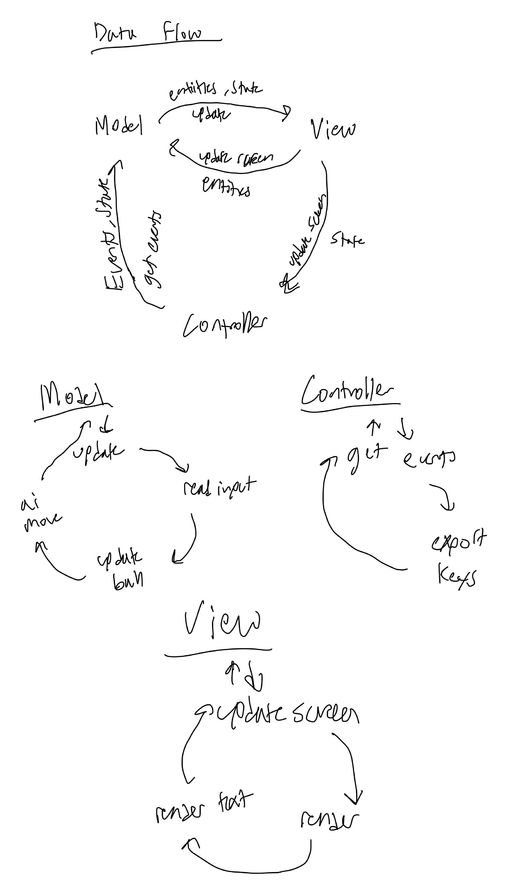

# pong4160




## Features
* Enemy AI paddle
* Random ball start location and velocity
* Ability to restart the game
* Smooth AI tracking
* Entity system

## How To Run

In the repo root run:
```python3 main.py```

## How To Play

```Up Arrow Key Moves the Paddle Up```
```Down Arrow Key Moves the Paddle Down```
```Press Enter to Restart at Game Over Screen```

## Program Versions
* OS: Fedora 37
    * Linux Kernel 6.1.13-200.fc37.x86_64
* Python 3.11.2
* Pygame 2.1.3

## Motivation
I was motivated to create Pong the way I did because I enjoy playing single player games. It was important for me to create some for of AI to control the opposing paddle for this reason. I also wanted some level randomization, so the starting position and velocities are randomly chosen. The version of pong that most inspired me was Pong for the Atari 2600. This is what pong looks like in my mind, so I decided to emulate the general layout.

## Reasoning

### Paddle AI
The AI I created for the paddle is very rudimentary, tracking the balls position and attemtpting to match it. I did add a smooth moving function to allow the paddle to only move as much as it needed to to keep pace with the ball. Before I implemented this function, the paddle would become very jerky trying to match the ball's position. I think in its current state, the AI is neither easy nor hard to beat.

### Entities
I chose to implement the entity system with a list because I thought that it would be easy to add items to it later. It is also how I render items because I loop through the entity list and render each item that way. Unless I am adding a completely different entity type, I do not need to change the view code to render it to the screen.

### Game State
Most of the game state is wrapped up in the entities in the game. I did add a variable later that is passed between the Model, View, and Controller that is represents general game state. I needed to add this variable to represent game overs and add a quick way to restart the game.

### Bounds Checking
I used simple math to calculate bounds checking in a function. I did this since this was a simple game with basic collisions. I was able to add the different bounds of the screen and the paddles this way. This is an area of the game I would improve if I had extra time because some of the collisions result in wonky effects that could be fixed with some polishing.

### Model
The model has the most hard coded variables, but the entity system and bounds checking that the model uses are relatively generalizable. The input and update systems are also mostly generic.

### View
The view is mostly generalized. I achieved this by using a for loop to render an entity list. Because I added game over text very late in creation, this was more hardcoded towards the bottom of the update display function. Longer term, I would have text be part of a UI section that was generalized for text and buttons.

### Controller
The controller is the most generalized section of the engine. It grabs events from the game, and it chooses which ones to send to the model to process. 

## Architecture Diagram



## Future Work

### Possible Enhancements

1. I would like to add proper angle calculations to improve the realism of the game.
2. I would like to improve the ai to make it seem more believable by giving the ai fuzzy ball positions.
3. I would like to add a scoring mechanic to the UI.

### Generalizations

* entity system
* boundary checking
* view
* controller
* input from model
* update from model
* main game loop

These sections are all relatively generalizable. Other games that have simple physics behaviors and use a few simple shapes like balls and rectangles could easily be accomadated by this engine. Game logic would need to be rewritten of course, but a lot of the components are reusable. 